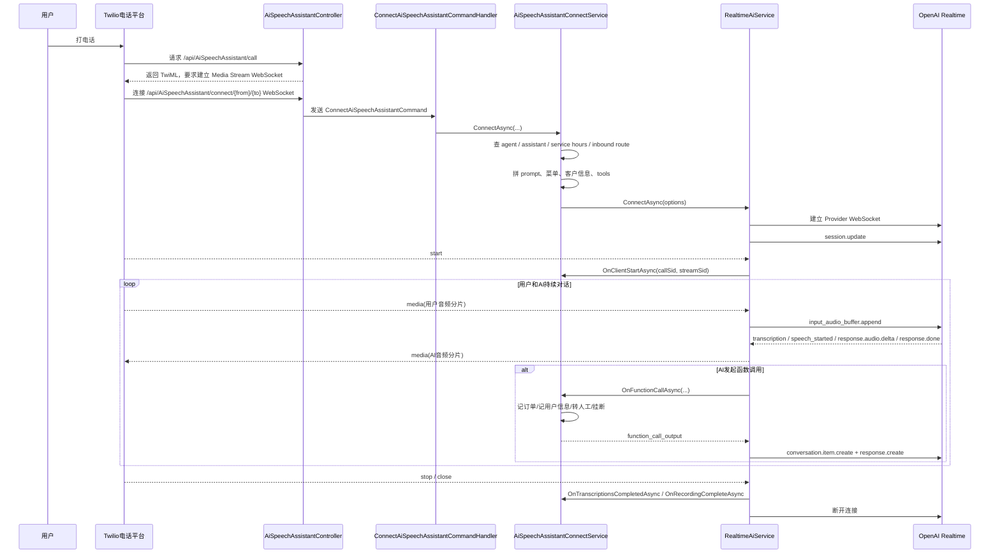

```mermaid
sequenceDiagram
    participant User as 用户
    participant Twilio as Twilio电话平台
    participant API as AiSpeechAssistantController
    participant Handler as ConnectAiSpeechAssistantCommandHandler
    participant V2 as AiSpeechAssistantConnectService
    participant RT as RealtimeAiService
    participant AI as OpenAI Realtime

    User->>Twilio: 打电话
    Twilio->>API: 请求 /api/AiSpeechAssistant/call
    API-->>Twilio: 返回 TwiML，要求建立 Media Stream WebSocket

    Twilio->>API: 连接 /api/AiSpeechAssistant/connect/{from}/{to} WebSocket
    API->>Handler: 发送 ConnectAiSpeechAssistantCommand
    Handler->>V2: ConnectAsync(...)

    V2->>V2: 查 agent / assistant / service hours / inbound route
    V2->>V2: 拼 prompt、菜单、客户信息、tools
    V2->>RT: ConnectAsync(options)

    RT->>AI: 建立 Provider WebSocket
    RT->>AI: session.update

    Twilio-->>RT: start
    RT->>V2: OnClientStartAsync(callSid, streamSid)

    loop 用户和AI持续对话
        Twilio-->>RT: media(用户音频分片)
        RT->>AI: input_audio_buffer.append

        AI-->>RT: transcription / speech_started / response.audio.delta / response.done
        RT-->>Twilio: media(AI音频分片)

        alt AI发起函数调用
            RT->>V2: OnFunctionCallAsync(...)
            V2->>V2: 记订单/记用户信息/转人工/挂断
            V2-->>RT: function_call_output
            RT->>AI: conversation.item.create + response.create
        end
    end

    Twilio-->>RT: stop / close
    RT->>V2: OnTranscriptionsCompletedAsync / OnRecordingCompleteAsync
    RT->>AI: 断开连接

```