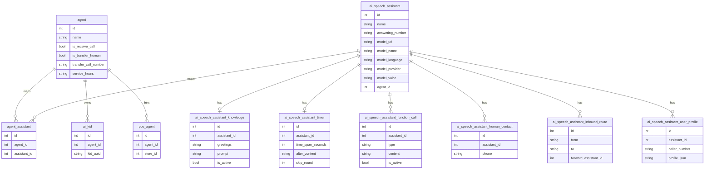

```mermaid
erDiagram
    agent ||--o{ agent_assistant : maps
    ai_speech_assistant ||--o{ agent_assistant : maps

    agent ||--o{ ai_kid : owns
    agent ||--o{ pos_agent : links

    ai_speech_assistant ||--o| ai_speech_assistant_knowledge : has
    ai_speech_assistant ||--o| ai_speech_assistant_timer : has
    ai_speech_assistant ||--o{ ai_speech_assistant_function_call : has
    ai_speech_assistant ||--o{ ai_speech_assistant_human_contact : has
    ai_speech_assistant ||--o{ ai_speech_assistant_inbound_route : has
    ai_speech_assistant ||--o{ ai_speech_assistant_user_profile : has

    agent {
        int id
        string name
        bool is_receive_call
        bool is_transfer_human
        string transfer_call_number
        string service_hours
    }

    ai_speech_assistant {
        int id
        string name
        string answering_number
        string model_url
        string model_name
        string model_language
        string model_provider
        string model_voice
        int agent_id
    }

    agent_assistant {
        int id
        int agent_id
        int assistant_id
    }

    ai_speech_assistant_knowledge {
        int id
        int assistant_id
        string greetings
        string prompt
        bool is_active
    }

    ai_speech_assistant_timer {
        int id
        int assistant_id
        int time_span_seconds
        string alter_content
        int skip_round
    }

    ai_speech_assistant_function_call {
        int id
        int assistant_id
        string type
        string content
        bool is_active
    }

    ai_speech_assistant_human_contact {
        int id
        int assistant_id
        string phone
    }

    ai_speech_assistant_inbound_route {
        int id
        string from
        string to
        int forward_assistant_id
    }

    ai_speech_assistant_user_profile {
        int id
        int assistant_id
        string caller_number
        string profile_json
    }

    ai_kid {
        int id
        int agent_id
        string kid_uuid
    }

    pos_agent {
        int id
        int agent_id
        int store_id
    }

```