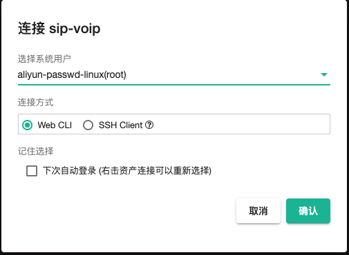
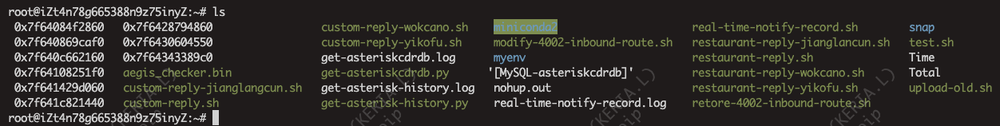
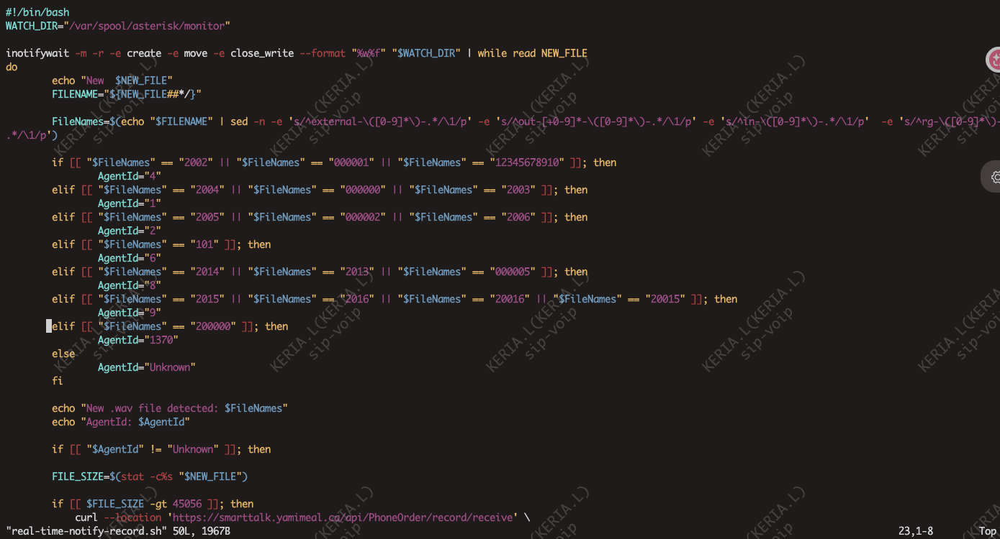
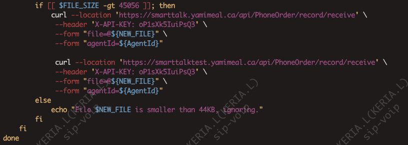
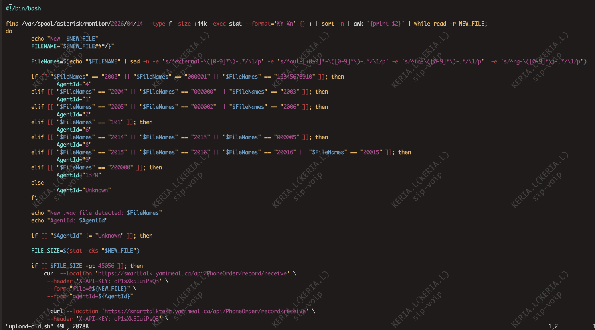
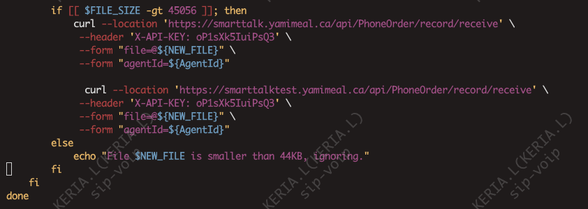
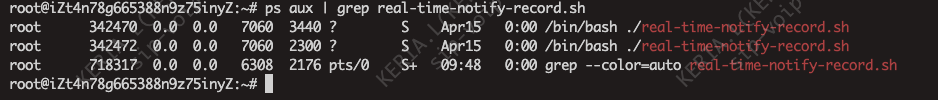

# 简介

JumpServer连接

Real-time-notify-record.sh是负责实时监控语音并上传到smt的脚本

upload-old.sh是负责重新上传某一天语音到测试环境和正式环境的脚本

sudo vim '文件名'查看文件

## Real-time-notify-record.sh

## upload-old.sh

# 处理办法语音没有上传到smt的办法

1. 检查后台脚本是否运行：ps aux | grep real-time-notify-record.sh

异常情况是少了一条或两条，运行：

nohup ./real-time-notify-record.sh > real-time-notify-record.log 2>&1 &

再查看一下是否添加成功

2.把upload-old.sh里的日期修改成需要重新上传录音的日期，然后运行此文件，命令 -->   ./upload-old.sh