电话通信软硬件基本概念

# **VoIP（Voice over Internet Protocol）**

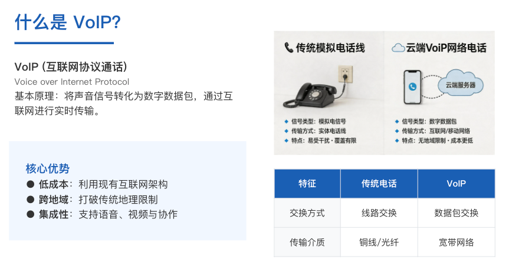

原理比喻：把一封信拆分成多张明信片寄出，到达目的地后再重新组装起来

对比传统的电话（PSTN），PSTN使用的是线路交换，通话时必须独占一条物理链路，而VoIP使用的是数据包交换。

### VoIP步骤

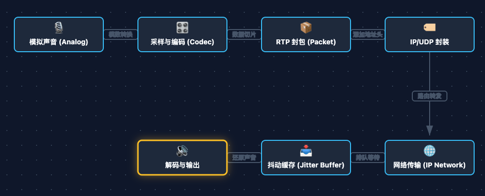

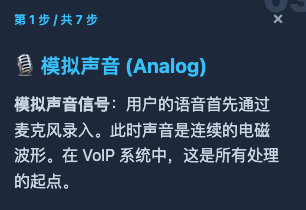

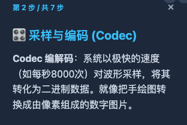

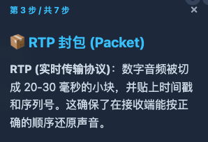

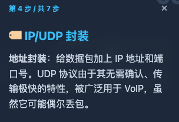

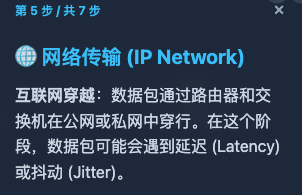

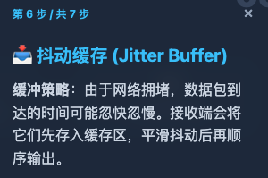

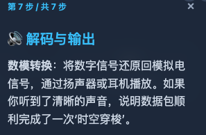

# **SIP**（Session Initiation Protocol）

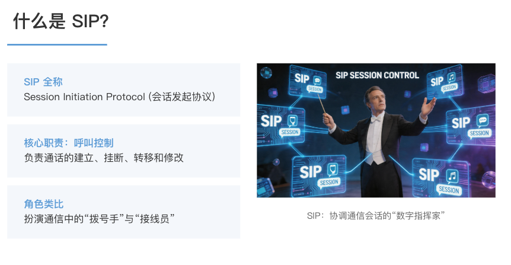

SIP握手：

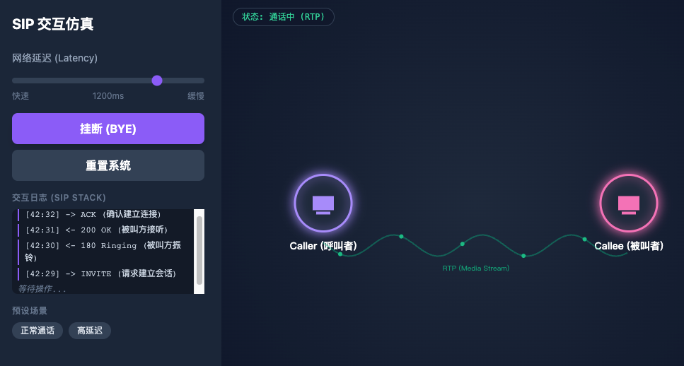

# **SIP与VoIP关系**

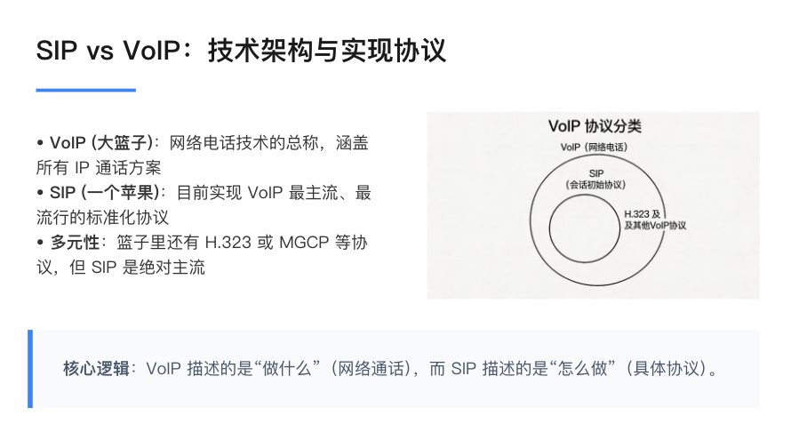

VoIP：将语音转化为数据包，在IP网络上进行实时传输

SIP协议：通话管家，负责从拨号到挂断过程中，数据包的有序工作而引入的协议

微信语音通话，游戏内的实时语音聊天系统，都是用到VoIP与SIP

# **FreePBX**（Free Private Branch eXchange）

PBX：Private Branch eXchange（用户级交换机 / 企业内部电话交换机）

核心功能还有一条：IVR语音菜单，类似 “粤语请按1，普通话请按2”

FreePBX 负责：

- 查找分机是否在线
- 建立 SIP 通话
- 接通、挂断、转接

# **Twilio**

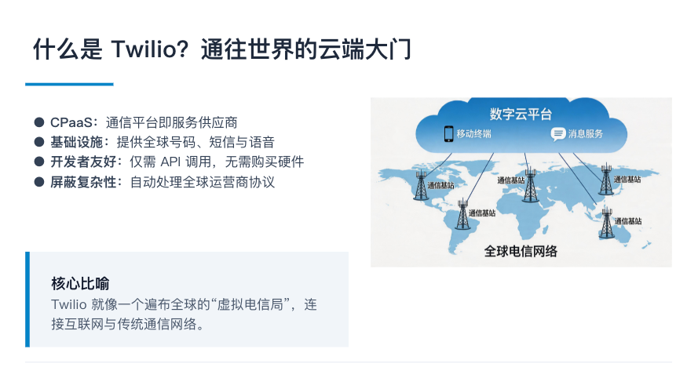

# **OpenVox**

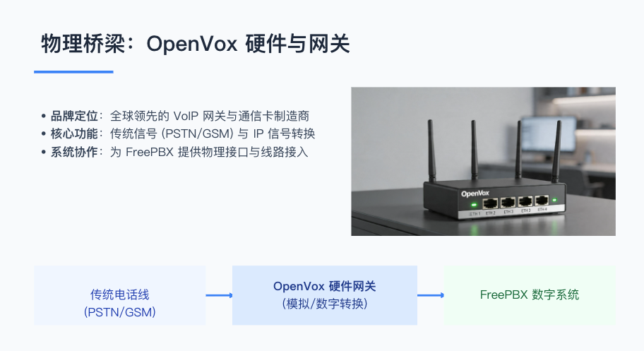

# **Trunk**

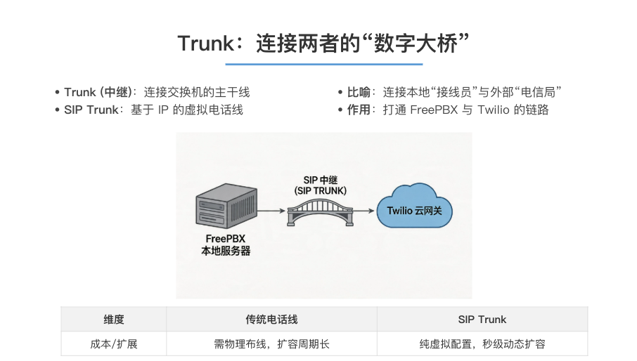

**餐厅打分机：只走 FreePBX，不走任何 Trunk**

**Trunk 只在 FreePBX 里配置，一台 PBX 可以配很多条 Trunk，是 FreePBX 连接外部线路的 “入口 / 出口” 定义**

**FreePBX 想连外部电话，必须配 Trunk**

**一个 Trunk 就是一条双向外线，里面可开多条通道同时通话，能入也能出；**

# **Extension**

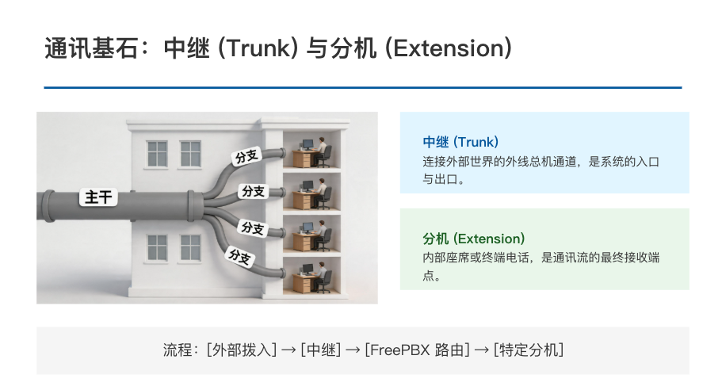

# **Webhook**

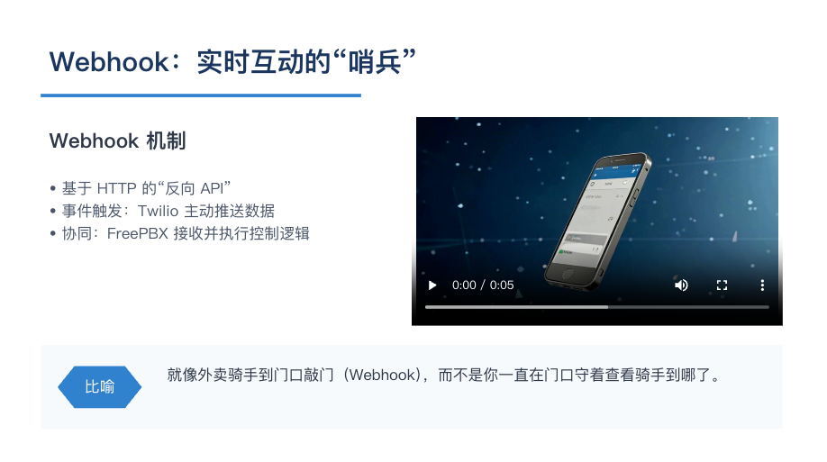

# **Route**

### InboundRoute 

电话已经进到FreePBX了，通过InboundRoute配置决定去AI软件还是直接去1001座机

### **OutboundRoute**

员工要打电话出去，OutboundRoute决定走Twilio还是OpenVox

比如：

- 打美国走 Twilio
- 打本地走 OpenVox

# **交互拓扑图**

## 总图

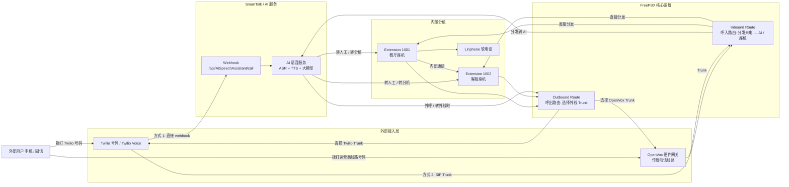

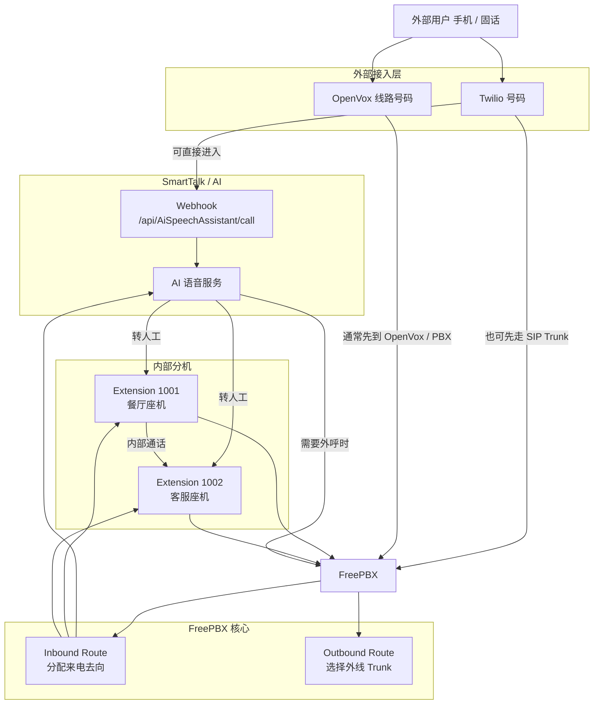

### 注意点

**OpenVox 是硬件转接，不提供号码**

**Twilio 是运营商，提供号码 + 线路**

**一个号码只能属于一家运营商**

**不可能同时走 Twilio + OpenVox**

**不管走 Twilio 还是 OpenVox，最终一定进 FreePBX**❌

update：走OpenVox，必须进FreePBX✅
		在twilio上配置了smt的call url，则不会进入FreePBX✅

**进 FreePBX 后，统一走 Inbound Route 分配去 AI 或座机**

**餐厅打分机：只走 FreePBX，不走任何 Trunk**

**Trunk 只在 FreePBX 里配置，一台 PBX 可以配很多条 Trunk，是 FreePBX 连接外部线路的 “入口 / 出口” 定义**

**FreePBX 想连外部电话，必须配 Trunk**

**一个 Trunk 就是一条双向外线，里面可开多条通道同时通话，能入也能出；**

#### 号码走Twilio还是OpenVox？

##### 0情况 A：号码买在 Twilio

→ 电话只进 Twilio

→ 再到 FreePBX

→ OpenVox 完全不参与

##### 情况 B：号码是当地电信的传统线

→ 电话线插 OpenVox

→ 转 SIP 到 FreePBX

→ Twilio 完全不参与

一条号码，只走一条路。

不可能一半走 Twilio，一半走 OpenVox。

## ① 呼入

1.用户 → PSTN/运营商网络 →  Twilio 号码(配置了smt的接口url) → Twilio Voice webhook →  AI 语音 → 转人工 → Extension 1001

2.用户 → PSTN/运营商网络 → Twilio 号码 → Trunk → FreePBX  →  InboundRoute →  Ring Group/Extension 1001

3.用户 →  PSTN/运营商网络 → 本地运营商号码 →  OpenVox网关  →  Trunk → FreePBX  → InboundRoete → 自定义目的地/AI 分机/外部转发 →  AI 语音 → 转人工 → Extension 1001

4.用户 → PSTN/运营商网络 → 本地运营商号码 →  OpenVox网关 → Trunk → FreePBX  →  InboundRoete →  Ring Group/Extension 1001

如果走的是OpenVox，底层是PSTN模拟线路，但是一定会转成SIP(或DAHDI)再进入FreePBX

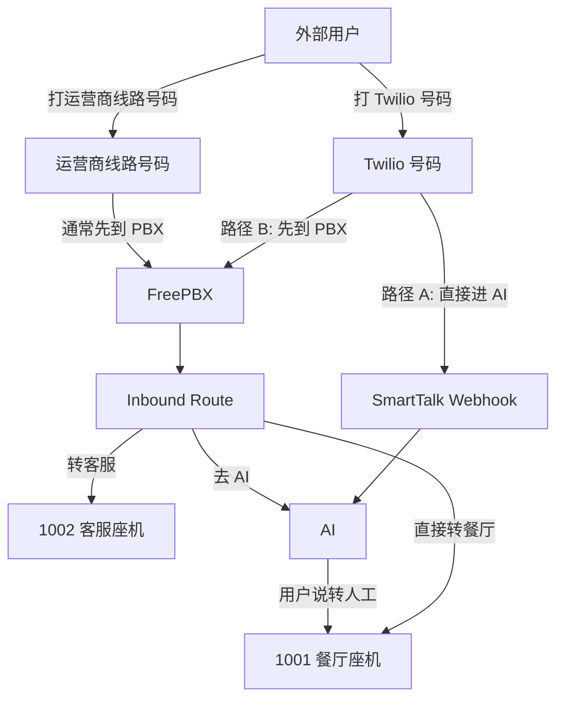

## ② 呼出

1001 分机 → FreePBX → Outbound Route → 选择 Trunk → Twilio或OpenVox → 用户手机

（用户显示：408-402-6529）

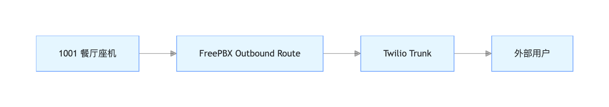

## ③  内部互打

1001 ↔ FreePBX ↔ 1002

（不走 Trunk、不走外网、只走FreePBX内部交换）内部互打拨的号码就是直接拨1001，1002

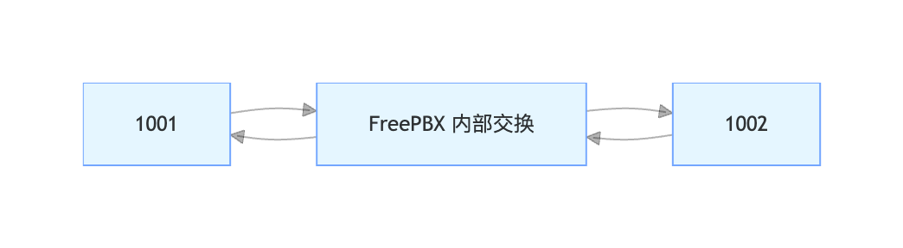
